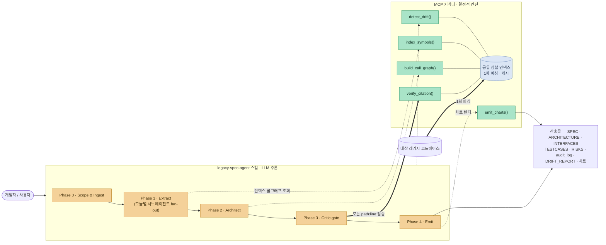
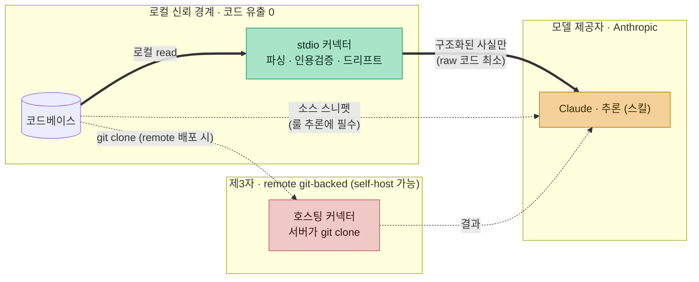

# Legacy Spec Agent — MCP 커넥터 설계서 (v0.1)

> 추론은 LLM이 하고, 근거 검증은 코드가 한다.
> 프롬프트만으로 돌아가던 파이프라인에서 결정적으로 처리할 수 있는 부분(파싱, 인용 검증, 드리프트 판정, 차트 렌더링)을
> MCP 커넥터로 분리한다. "근거 없는 문장은 싣지 않는다"는 원칙을 프롬프트 규칙이 아니라 코드로 강제하기 위해서다.

- **작성일**: 2026-07-16
- **버전**: v1.0
- **상태**: 마일스톤 C0–C6 구현 완료 (`connector/`). 본문은 설계 당시의 서술을 그대로 남겨 두었으며, 현재 구현 상태는 §10 표를 기준으로 한다.
- **이 문서가 답하는 기존 질문**:
  - `SPEC.md` §11-2 "RAG 백엔드: Chroma 신규 vs AnythingLLM 재사용" → **둘 다 아님, tree-sitter 심볼 인덱스 (§5)**
  - `SPEC.md` §11-4 "UI 범위: Streamlit vs 정적 리포트" → **커넥터가 결정적으로 렌더하는 정적 산출물 (§4 `emit_charts`)**
  - `references/agent-roles.md` "Phase-2 productization trigger" → **그 Phase-2의 구체 형태가 이 커넥터**

---

## 1. 문제 — agent-only 실행의 3대 비효율

현재 배포물은 순수 마크다운 스킬이고, 오케스트레이션·검증·산출물 생성 전부를 매 실행 LLM이 재결정한다. 여기서 세 가지 비효율이 발생한다.

| # | 비효율 | 저장소 내 근거 |
|---|--------|----------------|
| ① | **재현성·커버리지 편차** — fan-out 범위와 emit 산출물 세트가 실행마다 LLM 판단에 달림. INTERFACES/TESTCASES/RISKS는 "on request"라 전체 산출물 요구 시 누락 가능 | `SKILL.md` "Optional deliverables (on request)" 섹션 |
| ② | **파일 재독 토큰 낭비** — 모듈별 서브에이전트가 각자 파일을 다시 읽음. 공유 인덱스 부재 | `references/agent-roles.md` "Notes on the RAG question" — 스케일 병목을 "Phase-2 productization trigger"로 이미 명시 |
| ③ | **차트 애드혹** — 시각화는 `ARCHITECTURE.md`의 Mermaid 1개뿐. 커버리지 도넛·벤치마크 바 등은 매번 즉흥 생성이라 실행마다 모양·정확도가 흔들림 | `SKILL.md` Phase 2 (Mermaid만 규정) |

여기에 더해, 에이전트만으로 돌 때는 citation 검증까지 LLM이 스스로 한다. Critic gate가 인용된 라인을 다시 열어 보기는 하지만 그 판정 주체도 결국 LLM이므로, 라인 번호 환각을 구조적으로 차단하는 층이 없다.

---

## 2. 결론 아키텍처 — 하이브리드 (스킬 + MCP 커넥터)

역할 경계는 한 문장으로 요약된다. "이것이 진짜 비즈니스 룰인가"는 LLM이 판단하고, "이 인용이 실제 코드와 일치하는가"는 코드가 판정한다.



- 스킬(황색, LLM 추론): Phase 0–4 워크플로우는 `SKILL.md`의 것을 그대로 쓴다. 비즈니스 룰 해석과 명세 산문 작성은 계속 모델이 맡는다.
- 커넥터(녹색, 결정적): 파싱, 검증, 드리프트, 차트는 코드가 처리한다. LLM 판단이 개입하지 않으므로 실행할 때마다 같은 결과가 나온다.
- 색 구분은 산출물의 신뢰 등급과 일치한다. 녹색 경로의 결과는 기계가 검증한 사실이고, 황색 경로의 결과는 추론이므로 Critic gate와 `verify_citation`을 통과해야 본문에 실린다.

---

## 3. 커넥터 툴 계약 (Tool Contract)

| 툴 | 하는 일 | agent-only에서 대체하는 것 | 없애는 비효율 |
|----|---------|---------------------------|----------------|
| `index_symbols(root)` | tree-sitter/AST로 심볼(함수·클래스·엔트리포인트)을 1회 추출, 공유 인덱스에 캐시 | 서브에이전트별 파일 재독 | ② 토큰 재독 낭비 |
| `build_call_graph(root)` | import/호출 관계에서 모듈→모듈 엣지 리스트 생성 | Architect의 수동 엣지 추적 | ② + 엣지 누락/추측 |
| `verify_citation(path, line, claim)` | 주장한 `path:line`의 실제 소스와 claim의 일치 여부 판정 | Critic gate의 LLM 자기검토 | **인용 환각 원천 차단** |
| `detect_drift(spec_citations, ref?)` | 기존 인용 라인 vs 현재 코드(AST/diff) 비교 → 분류 | Mode B의 프롬프트 재해석 | Mode B 재현성 |
| `emit_charts(data)` | 구조화 데이터 → Mermaid·커버리지 도넛·벤치마크 바 렌더 | 즉흥 LLM HTML/다이어그램 생성 | ③ 차트 불일치 |

### 3.1 `verify_citation` 상세 (C1 마일스톤의 단독 증명 대상 — **구현됨**, `connector/src/verify.ts`)

```
입력:  { "path": "core/rule_engine.py", "line": 61,
         "expected_snippet": "if blocking_rules:",   // 선택 — 있으면 내용 검사 + moved 스캔
         "claim": "블로킹 룰이 있으면 경고를 버리고 차단",  // 선택 — 감사 로깅용
         "context_lines": 3 }
출력:  { "verdict": "match" | "line_mismatch" | "file_missing" | "content_mismatch",
         "actual_source": "<해당 라인 ±N줄, 라인번호 포함>",
         "suggested_line": 61,          // snippet을 파일 전체에서 발견 시 (moved 후보)
         "line_count": 180 }            // line_mismatch일 때 유효 범위 안내
```

기계가 보증하는 범위에는 경계가 있다. `expected_snippet` 없이 호출하면 "위치가 유효하고 원문을 정확히 돌려준다"까지만 보증하며, 자연어 claim이 그 코드로 뒷받침되는지의 의미 판단은 반환된 원문을 읽는 LLM Critic의 몫이다(§5의 2층 구조). snippet을 함께 주면 공백을 정규화한 내용 검사와 moved 후보 스캔이 추가된다.

- `verdict`가 `match`가 아니면 스킬은 해당 항목을 Unverified로 격리한다. `SKILL.md`의 Hard rule 1·2를 코드가 집행하는 셈이다.
- 판정 과정에 LLM이 없으므로 `audit_log.jsonl`의 verified/flagged 결정을 언제든 재현할 수 있다.

### 3.2 `detect_drift` 분류 — SKILL.md Mode B와 1:1 대응

| 커넥터 판정 | SKILL.md Mode B 분류 | 판정 방식 |
|-------------|----------------------|-----------|
| 인용 라인 동일 | **intact** | 유일화된 프로브가 원위치에서 발견 |
| 동일 코드가 다른 위치에 | **moved** | 프로브가 다른 위치에서 발견 → 새 라인 제안 |
| 프로브 미발견 (내용 변경) | **drifted** | 베이스라인 라인 원문이 현재 코드에 없음 |
| 파일 삭제 | **orphaned** | 인용 파일이 현재 트리에 부재 |
| 판정 불가 | **error** | git 레포 아님·ref unreadable·경로 이상 — **드리프트로 세지 않고 별도 보고** (에러를 드리프트로 혼입하면 가짜 100% 드리프트 리포트가 나온다) |

드리프트의 본질은 두 ref 사이에서 인용된 라인이 어떻게 변했는가이므로, git 기반 판정이 LLM의 재해석보다 정확하다. 판정 결과는 `DRIFT_REPORT.md` 템플릿의 분류를 그대로 채운다. "자동으로 고쳐 쓰지 않는다"는 Hard rule 3은 그대로 유지된다. 커넥터는 판정만 하고, 명세에 반영할지는 사람이 결정한다.

---

## 4. 산출물 정책 변경 — "on request" → "항상 emit"

목표가 "가능한 산출물 전부와 차트"이므로, 커넥터가 있는 환경에서는 emit 세트를 고정한다.

- 항상 생성: `SPEC.md`, `ARCHITECTURE.md`, `INTERFACES.md`, `TESTCASES.md`, `RISKS.md`, `audit_log.jsonl`, 그리고 커버리지·검증 차트.
- 세트가 고정될 뿐 근거 게이트는 그대로다. 각 항목의 citation 규칙과 격리 규칙은 변하지 않는다.
- 차트는 `emit_charts`가 데이터에서 결정적으로 렌더링한다. 검증 커버리지, 모듈별 claim 수, 드리프트 요약, 벤치마크 비교가 대상이다.

---

## 5. 기존 SPEC.md 기술스택과의 관계 — 무엇을 대체하는가

`SPEC.md` v0.1의 §5–6은 Python, LangGraph, Chroma로 구성된 독립 제품을 그렸지만, 실제 배포물은 Claude Code 스킬이 되었다. 이 문서는 그 두 갈래를 다음과 같이 통합한다.

| SPEC.md v0.1 구상 | 실제/커넥터 설계 | 근거 |
|--------------------|------------------|------|
| LangGraph 상태 그래프 오케스트레이션 | Claude Code 스킬 + 서브에이전트 fan-out (이미 동작 검증) | `demo-hookify/`, `evals/` |
| Chroma/AnythingLLM 벡터 RAG (F2) | **tree-sitter 심볼 인덱스** (커넥터 내장) | 임베딩 유사도보다 심볼·라인 정확성이 목적에 부합 — citation은 시맨틱 검색이 아니라 정확한 위치 조회 문제 |
| Streamlit UI (F8) | 커넥터가 렌더하는 정적 산출물 + `showcase.html` 계열 뷰어 | 서버 불필요, 산출물이 곧 데모 |
| Ingestor 에이전트 (§5) | `index_symbols` + `build_call_graph` (비-LLM) | 파싱은 추론이 아님 |
| Critic/Validator 에이전트 (§5) | LLM Critic(의미 판단) + `verify_citation`(위치·일치 판정)의 2층 구조 | 의미와 사실을 분리 |

요약하면 F2(RAG 인덱싱)는 벡터가 아니라 심볼 인덱스로 재해석되었고, F4(근거 부착), F6(드리프트), F7(감사로그)은 커넥터가 기계적으로 집행한다.

---

## 6. 설치·배포

설치 대상은 스킬(`SKILL.md`와 `references/`)과 커넥터(stdio 실행 파일) 두 가지다. 커넥터는 분석할 코드 체크아웃과 같은 곳에서 실행되어야 한다.

### 방식 A — Claude Code 플러그인 번들 (권장)

플러그인 하나에 스킬과 `.mcp.json`을 함께 넣으면 설치 한 번으로 둘 다 등록된다.

```
legacy-spec-plugin/
├── .claude-plugin/plugin.json
├── skills/legacy-spec-agent/
│   ├── SKILL.md
│   └── references/agent-roles.md
├── .mcp.json                  # 커넥터 선언
└── servers/connector          # 결정적 엔진 (또는 npx 배포로 대체)
```

```json
{
  "legacy-spec": {
    "command": "npx",
    "args": ["-y", "@legacy-spec/connector", "${CLAUDE_PROJECT_DIR}"]
  }
}
```

> ⚠️ 위 npx 형태는 **미배포 가칭**(§11-4)이다 — 현재 실제 배포는 npx가 아니라 번들 bootstrap(`.mcp.json` → `connector/bootstrap.mjs`) 방식이며, npm publish 전에는 아래 명령을 복붙해도 동작하지 않는다.

설치: 마켓플레이스 추가 → `/plugin install legacy-spec`.

### 방식 B — 개별 설치

```bash
# 현재 동작하는 형태 (npm 미배포 — npx 버전은 §11-4 확정 후):
claude mcp add legacy-spec -- node /path/to/legacy-spec-agent/connector/dist/src/index.js .
cp -r legacy-spec-agent ~/.claude/skills/
```

### 방식 C — 멀티엔진 인스톨러 (Reversa 스타일)

`npx @legacy-spec/install`이 설치된 엔진(Claude Code, Cursor, Windsurf 등)을 감지해 스킬을 복사하고 각 엔진의 MCP 설정에 같은 `command`를 기록한다. 웹 챗처럼 로컬 파일시스템이 없는 환경은 §7의 remote 배포로 커버한다.

### Graceful degradation (필수 규칙)

커넥터가 없는 환경에서도 스킬은 기존처럼 LLM만으로 동작해야 한다. 그래서 `SKILL.md`에 다음 규칙을 넣는다.

> 커넥터 툴(`verify_citation` 등)이 세션에 있으면 반드시 그것으로 검증하고, 없으면 인라인 Read/Grep으로 대체한다.

이렇게 하면 설치가 실패하거나 웹 환경이어도 스킬이 망가지지 않고, 커넥터가 있을 때만 검증과 차트가 결정적으로 강화된다.

---

## 7. Transport 2종 — 코드가 어디 있느냐가 기준

기준은 로컬이냐 원격이냐가 아니라 코드 체크아웃이 어디에 있느냐다. 원격 컨테이너(Claude Code on the web)나 CI에도 체크아웃은 존재하므로 stdio 방식이 그대로 동작한다.

| 배포 | 코드 소스 | 커버 서피스 | 트레이드오프 |
|------|-----------|-------------|--------------|
| **stdio (co-located)** | 로컬/컨테이너 파일시스템 | 데스크톱 CLI · 웹 세션 컨테이너 · CI | 코드 제3자 유출 0 · **미커밋 코드도 분석 가능** |
| **remote HTTP (git-backed)** | 커넥터 서버가 git URL+ref로 직접 clone | claude.ai 챗 · 모바일 등 FS 없는 곳 | repo 인증(GitHub App/OAuth) 필요 · 코드가 커넥터 호스트로 나감 (self-host로 완화) |

- 툴 계약(§3)은 두 transport에서 동일하며, 데이터 소스가 파일시스템이냐 git이냐만 다르다.
- Mode B 드리프트에는 오히려 git 기반이 자연스럽다. 두 ref 사이의 인용 라인 변화가 곧 diff이기 때문이다.

---

## 8. 신뢰 경계 · 데이터 흐름



| 배포 | 커넥터가 보는 코드 | 순 도달처 |
|------|---------------------|-----------|
| stdio 로컬 | 로컬에서만 — 유출 0 | **모델 제공자(Anthropic)만** |
| remote git-backed | 커넥터 서버로 clone | 모델 제공자 + 커넥터 호스트 (self-host 시 사내) |

피할 수 없는 사실이 하나 있다. 어떤 배포 방식이든 룰 추론에 쓰이는 소스 스니펫은 모델 제공자에게 전송되며, 이는 모든 LLM 기반 도구의 공통 조건이다. 다만 커넥터는 그 노출을 늘리지 않고 오히려 줄인다. 검증과 파싱을 로컬에서 끝내고 구조화된 사실만 모델에 넘기기 때문이다. 완전한 에어갭이 필요하다면 온프레미스 모델과 stdio 커넥터를 조합하는 방법뿐이다.

---

## 9. 경쟁 비교 — 정직 버전

가장 가까운 오픈소스는 Reversa(sandeco/reversa, MIT, arXiv:2605.18684)다. 두 프로젝트를 공정하게 비교하면 다음과 같다.

| 축 | Reversa | legacy-spec-agent + 커넥터 |
|----|---------|----------------------------|
| 지능 위치 | 100% 프롬프트 (호스트 LLM 위임, 자체 엔진 없음 — JS/셸은 인스톨러·스캐폴딩 전용) | 추론=LLM + **근거·검증=결정적 코드** |
| 제3자 코드 유출 | **없음** (자체 서버·API키 없음) | **없음** (stdio 기준) — **이 축은 동점** |
| 모델로 가는 raw 코드량 | 많음 — 파싱·검증·드리프트까지 전부 프롬프트라 원본을 통째로 LLM에 | 적음 — 커넥터 선처리 후 구조화된 사실 + 최소 스니펫 |
| citation 신뢰 | 3단 라벨(🟢CONFIRMED/🟡INFERRED/🔴GAP) — 추론도 본문에 라벨만 달고 게재 | **격리** — 근거 없으면 본문 미게재 + `verify_citation` 기계 판정 |
| 드리프트 | 대응물 없음 (regression-watch는 forward 구현 흐름의 부산물) | Mode B 인용 단위 재검증 (intact/moved/drifted/orphaned) |
| 정량 근거 | 공개 벤치마크 없음 | `evals/` — citation 커버리지 **0.86–0.87 vs baseline 0.00**, 표본 인용 정확도 6/6 |
| 폭 | 매우 넓음 (forward/migrate/bug/docs/pricing, 13개 엔진) | 좁고 깊음 (역추출 + 드리프트) |

포지셔닝을 요약하면 Reversa는 폭넓은 프레임워크이고 이쪽은 좁고 엄격한 코어다. 프라이버시를 내세울 때 "제3자로 코드가 안 나간다"는 문구는 쓰지 않는다. 그 축에서는 두 프로젝트가 동점이므로 그렇게 말하면 부정직해진다. 정직한 차별점은 모델에 노출되는 코드가 더 적다는 것과 근거를 코드로 검증한다는 것이다.

인접 프로젝트로는 OpenSpec(Fission-AI의 정방향 SDD 표준으로, 코드에서 spec을 역추출하는 spec-gen 제안이 논의 중이다. 커넥터 산출물의 OpenSpec 포맷 export는 §11-5의 열린 질문이다), RECoRD와 AgentModernize(학술 프레임워크), Swimm과 Mintlify(상용 문서화 도구로, grounding 개념이 없다)가 있다.

---

## 10. 마일스톤 — 커넥터 트랙 (SPEC.md §10과 정합)

SPEC.md의 M0–M4는 스킬 트랙으로 이미 상당 부분 달성되었다(demo-hookify가 M2–M4에 해당한다). 커넥터는 별도 트랙으로 진행한다.

| 단계 | 범위 | 완료 기준 | 상태 |
|------|------|-----------|------|
| **C0** | stdio MCP 서버 스캐폴드 (툴 5개 시그니처 + 더미 응답) | `claude mcp add`로 등록, 툴 목록 노출 | ✅ `connector/` (TypeScript, SDK 클라이언트 스모크로 5툴 노출 확인) |
| **C1** | `verify_citation` 실동작 (단일 언어 우선) | demo-hookify의 audit_log 12건 판정을 기계 재현 | ✅ 12/12 재현 (verified 9 · flagged 3, `connector/test/replay-audit.test.ts`) |
| **C2** | `index_symbols` + `build_call_graph` | 재독 없이 Phase 1 fan-out 지원, 토큰 사용량 전후 비교 | ✅ 구현 (Python/tree-sitter — hookify 10파일·20심볼·내부엣지 9 검증. 토큰 전후 비교는 스킬측 eval로 미실행) |
| **C3** | `detect_drift` (git diff + AST) | 의도 변경 1건 → drifted 플래그 데모 (SPEC.md §9 시나리오 3) | ✅ 구현 (baseline_ref 방식 — 의도 변경 데모 테스트로 4분류 전부 재현 + hookify 12건 intact 검증. AST 비교는 라인 프로브로 대체, 언어 무관) |
| **C4** | `emit_charts` + 플러그인 패키징 (방식 A) | `/plugin install` 한 번으로 전체 동작 | ✅ 차트 5종 + 플러그인 패키징. 실제 설치로 스킬 1개와 MCP 서버 1개 등록을 확인했고, 의존성 없는 사본에서 bootstrap이 자동 설치·빌드하는 것까지 검증. 스킬 사본 드리프트는 테스트가 잠근다 |
| **C5** | 추가 산출물 추출기 | ERD·온보딩·CHANGELOG 생성 | ✅ `extract_data_model`, `extract_project_meta`, `extract_changelog` 구현. hookify에서 Rule/Condition 관계, 플러그인 메타데이터, 환경변수 복원을 검증 |
| **C6** | 스케일 대응 | 대형 레포에서 토큰·가독성 한계 해소 | ✅ `limit`(절단 시 `truncated` 보고)과 `granularity:"package"` 추가, `architectureChart`에 `cluster` 옵션. hookify에서 파일 엣지 9개가 `hooks → core (weight 8)` 하나로 접히는 것을 검증 |

최소 증명점은 C1이었다. `verify_citation` 하나만 동작해도 근거를 코드로 강제한다는 차별점(§9)이 성립하기 때문이다.

---

## 11. 열린 질문

1. **구현 언어**: TypeScript(MCP SDK 성숙, npx 배포 자연) vs Python(tree-sitter 바인딩·기존 grade.py와 일관) → **답변됨: TypeScript (`connector/`)**
2. **tree-sitter 언어 우선순위**: Python 먼저(SPEC.md §11-1과 일관) vs demo-hookify가 Python이므로 Python+TypeScript 동시
3. **remote 배포 인증**: GitHub App vs OAuth vs PAT — C4 이후로 연기 가능
4. **npm 패키지명**: `@legacy-spec/connector` 가칭 — 제품명 확정(SPEC.md §11-5)과 함께 결정
5. **OpenSpec 호환 export**: 커넥터 산출물을 OpenSpec 포맷으로도 내보낼지 (생태계 편승 vs 유지비)

## 12. 산출물 커버리지 — 필수 문서 대비

소프트웨어 개발에 통용되는 필수 문서 세트와 현재 산출물을 대조한 표다. 생성 대상인지 아닌지는 "코드로 근거를 만들 수 있느냐"로 갈린다.

| 필수 문서 | 산출물 | 근거 소스 |
|---|---|---|
| 요구사항·비즈니스 규칙 | ✅ `SPEC.md` | 코드 (LLM 추출 + Critic 게이트) |
| 아키텍처 (구조+동작) | ✅ `ARCHITECTURE.md` | `build_call_graph` + 흐름도 |
| API 명세 | ✅ `INTERFACES.md` | 시그니처 |
| 테스트 | ✅ `TESTCASES.md` | 특성화 |
| 리스크 | ✅ `RISKS.md` | flagged 항목 |
| 변경추적 | ✅ `DRIFT_REPORT.md` · `audit_log.jsonl` | `detect_drift` |
| **데이터 모델 (ERD)** | ✅ `DATA_MODEL.md` | `extract_data_model` (C5) |
| **온보딩 (빌드·실행·의존성·env)** | ✅ `ONBOARDING.md` | `extract_project_meta` (C5) |
| **CHANGELOG** | ✅ `CHANGELOG.md` | `extract_changelog` (C5, git 로그) |
| ADR (결정 근거) | ❌ 비대상 | 코드는 "무엇을"만 보여준다. "왜"는 미검증 격리 대상 |
| PRD / 사용자 매뉴얼 | ❌ 비대상 | 비즈니스 맥락과 UX 의도는 코드 밖에 있다 |

ADR이나 PRD를 억지로 생성하지 않는 것 자체가 이 프로젝트의 원칙을 지키는 방법이다. 근거 없는 문장은 싣지 않는다.

### 스케일 (C6)

산출물은 프로젝트 크기에 따라 다르게 커진다. 커버리지나 드리프트 차트 같은 집계형 산출물은 카운트로 요약되므로 크기가 고정이다. 반면 심볼, 엣지, 엔티티처럼 항목을 나열하는 산출물은 코드 크기에 선형으로 비례해서, 대형 레포에서는 MCP 응답이 토큰 한계를 넘고 다이어그램은 읽을 수 없게 된다.

두 가지 장치로 대응하며, 둘 다 결정적이고 무음 절단이 없다.

- 경계: `limit`으로 상한을 두고, 초과하면 `truncated: {returned, total, omitted}`를 함께 반환한다. 스킬은 이 값을 coverage 라인에 그대로 노출한다. 호출자가 limit을 주지 않아도 안전하도록 기본 상한이 있다(심볼 2000, 엣지 500, 엔티티 200).
- 줌아웃: `granularity: "package"`가 파일 단위 결과를 패키지 단위로 접는다. 심볼은 카운트만 남고 엣지는 `weight`가 붙은 패키지 간 엣지가 된다. `emit_charts`의 `cluster: true`는 파일 노드를 패키지별 `subgraph`로 묶는다. 수백 노드짜리 그래프가 수십 개 패키지로 줄어든다.
