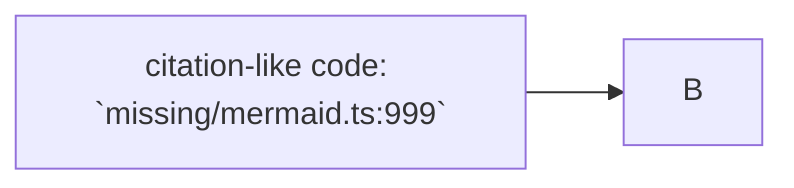

CLM-101: A normal citation appears before a fence. `src/server.ts:1`

```text
CLM-FAKE-1: This citation-like string is code. `missing/fake.ts:999`
~~~
```
CLM-102: Parsing resumes immediately after a closing fence. `src/server.ts:2`


CLM-103: The first citation after Mermaid is collected. `src/server.ts:1-2`
CLM-104: The second citation after Mermaid is collected. `src/server.ts:2`

````text
```
CLM-FAKE-2: A shorter backtick run does not close this fence. `missing/short-close.ts:999`
````
CLM-105: A matching-length closing fence resumes parsing. `src/server.ts:1`
