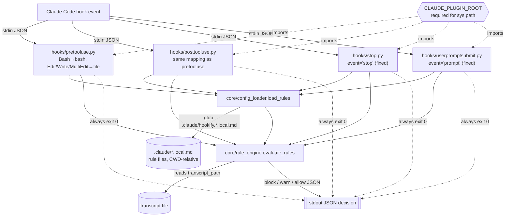
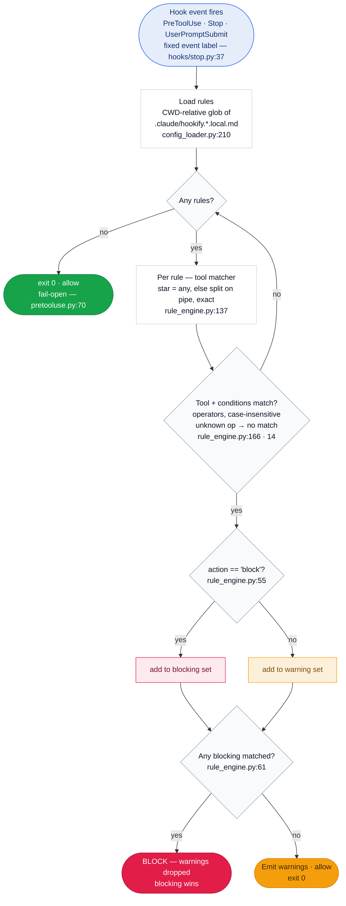

# hookify — Architecture (reconstructed)
> From `plugins/hookify/` @ `15a21e1`. Edges trace to code; see citations in `SPEC.md`.

**Reading the graph**
- All four entrypoints are thin dispatchers over the same two core functions (`load_rules`, `evaluate_rules`). The only per-hook difference is how the **event label** is chosen.
- Two external I/O surfaces: the CWD-relative `.claude/*.local.md` rule files, and the per-rule `transcript_path` read.
- The dotted `always exit 0` edges encode the **fail-open** contract — every path ends at a printed JSON and a zero exit.

## Rule evaluation — control flow

The graph above is *structure* (who calls what). This is *behavior* — how one event resolves to block / warn / allow. Every node cites the code it was reconstructed from.

Every branch traces to a verified `audit_log.jsonl` entry: event labels (`hk-event-labels`), CWD-relative rule discovery (`cl-cwd-relative`), tool matcher (`re-tool-matcher`), operators + case-insensitivity (`re-operators`, `re-ignorecase`), block-vs-warn (`re-block-action`), blocking precedence (`re-block-precedence`), and the fail-open exit (`hk-fail-open`).
