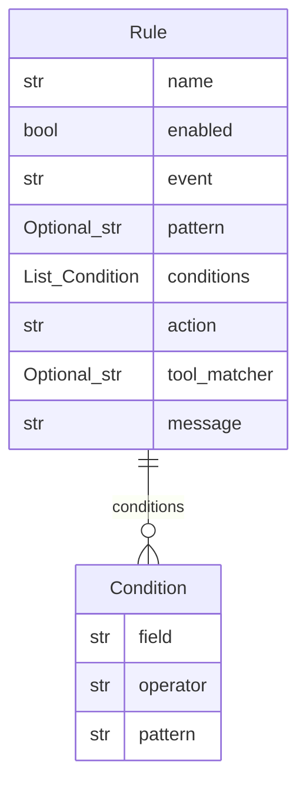

# hookify — Data Model (reconstructed)
> From `plugins/hookify/` @ `15a21e1`. Entities and fields trace to code; relations only where a field type states them.

## `Condition` — `core/config_loader.py:16`
- `field: str`  `core/config_loader.py:18`
- `operator: str`  `core/config_loader.py:19`
- `pattern: str`  `core/config_loader.py:20`

## `Rule` — `core/config_loader.py:33`
- `name: str`  `core/config_loader.py:35`
- `enabled: bool`  `core/config_loader.py:36`
- `event: str`  `core/config_loader.py:37`
- `pattern: Optional[str]` *(optional)*  `core/config_loader.py:38`
- `conditions: List[Condition]` *(optional)*  `core/config_loader.py:39`
- `action: str` *(optional)*  `core/config_loader.py:40`
- `tool_matcher: Optional[str]` *(optional)*  `core/config_loader.py:41`
- `message: str` *(optional)*  `core/config_loader.py:42`

## Relations
- `Rule` has many `Condition` (via `conditions`)
