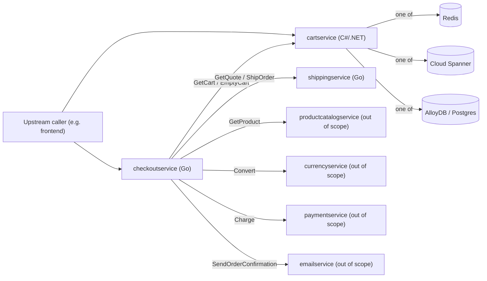

# ARCHITECTURE.md — Online Boutique: cartservice, checkoutservice, shippingservice

Analyzed source commit: 9a4616e77f0f9cbcbecaf27d711c38890dda1404
Generated at: 2026-07-30 (Mode A standard, actor writer-ext3)
Coverage: `src/cartservice/**`, `src/checkoutservice/**` (excluding `genproto/**`), `src/shippingservice/**` (excluding `genproto/**`). No truncation.

## System context

Three components are in scope: cartservice (C#/.NET, gRPC), checkoutservice (Go, gRPC) and shippingservice (Go, gRPC). checkoutservice is the orchestrator: it calls cartservice and shippingservice (both in scope) plus product catalog, currency, payment and email services (all out of scope). cartservice depends on exactly one of three external data stores at a time (Redis, Spanner or AlloyDB/Postgres), also out of scope as infrastructure.

- checkoutservice holds address and connection fields for six downstream services: shipping, product catalog, cart, currency, email and payment. `CLM-045`: `src/checkoutservice/main.go:69-85`

## Component inventory

- cartservice: `CartService` (gRPC surface), `ICartStore` (storage abstraction) with three implementations — `RedisCartStore`, `SpannerCartStore`, `AlloyDBCartStore` — and `HealthCheckService`. See `API-CARTSERVICE`, `API-ICARTSTORE`, `API-REDISCARTSTORE`, `API-SPANNERCARTSTORE`, `API-ALLOYDBCARTSTORE`, `API-HEALTHCHECK` in `INTERFACES.md`.
- checkoutservice: a single `checkoutService` struct (`DM-CHECKOUTSERVICE-STRUCT`) implementing `PlaceOrder` (`API-CHECKOUT-PLACEORDER`) plus a health check, and an internal `money` package implementing `BR-MONEY-SIGN-MATCH`/`BR-MONEY-NANOS-RANGE`/`BR-MONEY-SUM-CURRENCY`.
- shippingservice: a `server` struct (`DM-SHIPPING-SERVER`) implementing `GetQuote` (`API-SHIPPING-GETQUOTE`) and `ShipOrder` (`API-SHIPPING-SHIPORDER`), backed by `quote.go` (`DM-QUOTE`) and `tracker.go`.

## Runtime and deployment

- cartservice's Kestrel HTTP server is configured to speak HTTP/2 by default. `CLM-046`: `src/cartservice/src/appsettings.json:10-13`
- Container base images, exposed ports and container-level environment defaults for all three services are declared only in their Dockerfiles, which are not a citable source under this gate; see `UV-DOCKERFILE-RUNTIME` in `SPEC.md` and the operational notes in `ONBOARDING.md`. No further runtime/deployment claim is presented as verified here.

## Module dependency

`graph_type: module_dependency`, `resolution: syntax`. This view is syntax-level source-file/namespace import structure gathered by direct reading, not a compiler-resolved or runtime call graph — it does not represent method calls or dynamic dispatch, and no tool in this run claims otherwise.

- checkoutservice's `main.go` imports its own local `money` package as its only intra-repository, in-scope module dependency; it separately imports the excluded, generated `genproto` package for wire types (out of scope for this analysis). `CLM-047`: `src/checkoutservice/main.go:17-43`
- cartservice's `Startup.cs` depends on the `cartservice.cartstore` and `cartservice.services` namespaces, wiring the store implementations and the gRPC service classes together at startup. `CLM-048`: `src/cartservice/src/Startup.cs:10-11`
- shippingservice's `main.go`, `quote.go` and `tracker.go` are all in Go package `main` — a single-package binary with no intra-repository package imports beyond the excluded `genproto`.
- Resolved intra-scope import edges: 2 (checkoutservice→money; cartservice.Startup→{cartstore, services}). Unresolved/out-of-scope edges: 2 (checkoutservice→genproto, shippingservice→genproto), both excluded by the frozen scope, not by parse failure.

## External systems and data stores

- cartservice's three candidate external stores (Redis, Spanner, AlloyDB) are selected via environment-configured addresses/connection strings. `CLM-049`: `src/cartservice/src/Startup.cs:29-32`
- checkoutservice calls cartservice's `GetCart`/`EmptyCart` (in scope). `CLM-050`: `src/checkoutservice/main.go:324-329`
- checkoutservice calls shippingservice's `GetQuote`/`ShipOrder` (in scope). `CLM-051`: `src/checkoutservice/main.go:313-321`
- checkoutservice calls an external product catalog service's `GetProduct` (out of scope; see `UV-PRODUCTCATALOG-CONTRACT` in `INTERFACES.md`). `CLM-052`: `src/checkoutservice/main.go:339-357`
- checkoutservice calls an external currency service's `Convert` (out of scope; see `UV-CURRENCY-CONTRACT`). `CLM-053`: `src/checkoutservice/main.go:359-366`
- checkoutservice calls an external payment service's `Charge` (out of scope; see `UV-PAYMENT-CONTRACT`). `CLM-054`: `src/checkoutservice/main.go:369-376`
- checkoutservice calls an external email service's `SendOrderConfirmation` (out of scope; see `UV-EMAIL-CONTRACT`). `CLM-055`: `src/checkoutservice/main.go:379-383`

## Major execution flows

PlaceOrder (checkoutservice, `API-CHECKOUT-PLACEORDER`) is the only multi-step orchestration in scope:
1. Retrieve the user's cart from cartservice (see External systems and data stores above).
2. Price each item and convert to the user's currency via the external product catalog and currency services (see External systems and data stores above).
3. Quote shipping from shippingservice (see External systems and data stores above).
4. Charge the card via the external payment service (`BR-CHECKOUT-CHARGE-THEN-SHIP`; see External systems and data stores above).
5. Ship the order via shippingservice's `ShipOrder`. `CLM-056`: `src/checkoutservice/main.go:386-393`
6. Empty the user's cart in cartservice, best-effort (`BR-CHECKOUT-CART-CLEAR-BEST-EFFORT`). `CLM-057`: `src/checkoutservice/main.go:332-336`
7. Send an order-confirmation email via the external email service, best-effort (`BR-CHECKOUT-EMAIL-BEST-EFFORT`; see External systems and data stores above).

## Trust boundaries

- checkoutservice's outbound gRPC connections to all six downstream services are established with `insecure.NewCredentials()` — no TLS/mTLS is configured at the application layer for any of these calls (see `RSK-INSECURE-GRPC-TRANSPORT` in `RISKS.md`). `CLM-058`: `src/checkoutservice/main.go:214-216`
- cartservice's Redis connection is configured with only a hostname/port string; no TLS or credential handling is visible in this code, so the trust boundary for Redis transport/auth is external to the analyzed source. `CLM-059`: `src/cartservice/src/Startup.cs:36-39`
- shippingservice exposes gRPC server reflection unconditionally (`SPEC.md` Operational behavior), widening its introspectable surface to any caller that can reach the port.

## Analysis limitations

This architecture view is built from direct, per-file reading of the in-scope C# and Go source under the pinned commit; it is not a compiler-resolved or IDE-assisted call graph for either language, and it does not resolve dynamic dispatch, reflection-based invocation, or the wire contracts defined only in excluded/out-of-scope `.proto` and `genproto/` sources (see `UV-CART-PROTO-SCHEMA` and `UV-CHECKOUT-SHIPPING-PROTO-SCHEMA` in `SPEC.md`). Container/deployment topology is not verified here (see `UV-DOCKERFILE-RUNTIME`). No truncation occurred in this run.
