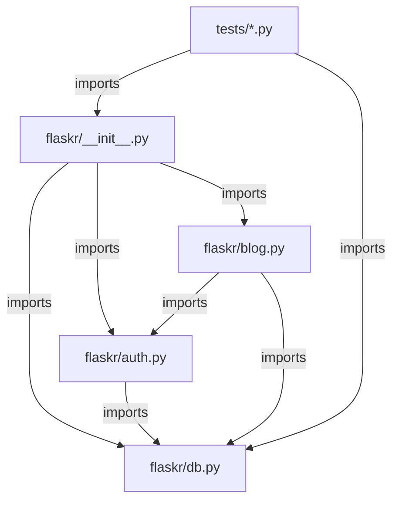

# ARCHITECTURE.md — Flaskr

Analyzed source commit: 36e4a824f340fdee7ed50937ba8e7f6bc7d17f81
Generated at: 2026-07-30
Scope: same as SPEC.md — examples/tutorial/flaskr/** and examples/tutorial/tests/**; non-citable files (schema.sql, data.sql, *.html, style.css, pyproject.toml, README.rst) are described only where explicitly marked Unverified. Not truncated.

## System context
Flaskr is a single-process Flask WSGI application: an HTTP client sends browser requests to the app, the app reads and writes a local SQLite database file, and returns rendered HTML pages (CLM-043: `examples/tutorial/flaskr/blog.py:25`).

## Component inventory
- flaskr package / application factory — builds the app, loads config, registers the CLI command and blueprints (CLM-044: `examples/tutorial/flaskr/__init__.py:6-40`).
- auth blueprint — registration, login, logout, and the login_required / load_logged_in_user session helpers (CLM-045: `examples/tutorial/flaskr/auth.py:16`).
- blog blueprint — post index, create, update, delete (CLM-046: `examples/tutorial/flaskr/blog.py:13`).
- db module — SQLite connection lifecycle and the init-db CLI command (CLM-047: `examples/tutorial/flaskr/db.py:9-56`).
- tests suite — pytest fixtures and test modules exercising the above (CLM-048: `examples/tutorial/tests/conftest.py:15-44`).

## Runtime and deployment
The analyzed .py sources define only a WSGI application object returned by the factory function (CLM-049: `examples/tutorial/flaskr/__init__.py:48`); no citable source configures a specific host, port, process manager, or container. The operator-facing run/init commands are documented only in the non-citable README.rst — see UV-002 in SPEC.md.

## Module dependency
graph_type: module_dependency, resolution: syntax. This is a syntax-level import graph, not a compiler-resolved or runtime method call graph; it does not represent method calls or dynamic dispatch.

Resolved import edges (all internal, syntax-level, high confidence):
- flaskr/__init__.py imports flaskr/db.py, flaskr/auth.py, and flaskr/blog.py (CLM-050: `examples/tutorial/flaskr/__init__.py:31-37`).
- flaskr/auth.py imports flaskr/db.py (CLM-051: `examples/tutorial/flaskr/auth.py:14`).
- flaskr/blog.py imports flaskr/auth.py and flaskr/db.py (CLM-052: `examples/tutorial/flaskr/blog.py:10-11`).
- tests/conftest.py imports the flaskr package and flaskr/db.py (CLM-053: `examples/tutorial/tests/conftest.py:6-8`).

Unresolved/external edges: flask, werkzeug, click, sqlite3, and pytest are external packages or stdlib modules, not part of the analyzed module set (CLM-054: `examples/tutorial/flaskr/auth.py:1-12`).

No call graph is produced or implied by this section: the diagram above shows syntax imports only, not a call graph.

## External systems and data stores
- SQLite database file at the configured DATABASE path — the only external data store, opened via sqlite3.connect (CLM-055: `examples/tutorial/flaskr/db.py:15-16`).
- No network calls, message queues, caches, or third-party APIs exist in the analyzed .py sources (searched: all files in Coverage) — Not found.

## Major execution flows
- Request lifecycle: load_logged_in_user runs before every request, populating g.user from the session (CLM-056: `examples/tutorial/flaskr/auth.py:32-33`).
- Request lifecycle: the database connection opened during a request is torn down at the end of the application context (CLM-057: `examples/tutorial/flaskr/db.py:55`).
- Post mutation flow: blog update/delete first resolve and authorize via get_post, then validate input, then write and commit, then redirect to the index (CLM-058: `examples/tutorial/flaskr/blog.py:86-110`).

## Trust boundaries
- The HTTP boundary between an untrusted client and the app: all submitted form fields are read via request.form (CLM-059: `examples/tutorial/flaskr/auth.py:54-55`).
- The session/cookie boundary: the stored user id is trusted server-side state signed by SECRET_KEY; no other client-supplied token is used for authorization (CLM-060: `examples/tutorial/flaskr/auth.py:104`).
- The process/SQLite boundary: only the db module opens the database connection; no other module talks to SQLite directly (CLM-061: `examples/tutorial/flaskr/db.py:9-20`).

## Analysis limitations
This document is generated from syntax-level reading of the Python sources; it does not include a compiler-resolved call graph (see Module dependency above) and does not resolve Jinja2 template-rendering internals, since templates are .html files outside this workflow's citable extensions (searched: flaskr/templates/**) — Not found as a citable evidence source, discussed only qualitatively.
