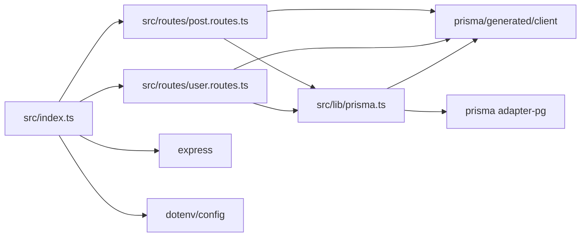

# ARCHITECTURE — rest-express-docker-aws-ec2

Analyzed source commit: eb8f4328821c6746680a2ba02e0e5636a085a327
Generated at: 2026-07-30
Coverage: all in-scope files were read in full (src/**, prisma/**, package.json, tsconfig.json, .env.example, Dockerfile, docker-compose.yml, README.md); excluded by scope manifest: .github/**, prisma.config.ts, .dockerignore, .gitignore. No truncation occurred.

## System context

External HTTP clients call a single Express process, which persists to PostgreSQL through Prisma.

- CLM-056: The README frames the system as a Prisma REST API deployed to AWS EC2 using Docker and GitHub Actions (`deployment-platforms/rest-express-docker-aws-ec2/README.md:3`).
- CLM-057: The runtime is one Express application instance (`deployment-platforms/rest-express-docker-aws-ec2/src/index.ts:6`).

## Component inventory

- CLM-058: Bootstrap component: wires the JSON body parser and both routers into the application (`deployment-platforms/rest-express-docker-aws-ec2/src/index.ts:8-10`).
- CLM-059: Data-access component: exports the shared Prisma client used by every route (`deployment-platforms/rest-express-docker-aws-ec2/src/lib/prisma.ts:10`).
- CLM-060: Post routing component: defines the post-related HTTP routes (`deployment-platforms/rest-express-docker-aws-ec2/src/routes/post.routes.ts:5`).
- CLM-061: User routing component: defines the user-related HTTP routes (`deployment-platforms/rest-express-docker-aws-ec2/src/routes/user.routes.ts:5`).

## Runtime and deployment

- CLM-062: Development runtime: the dev script runs the TypeScript entrypoint directly after generating the Prisma client and typechecking (`deployment-platforms/rest-express-docker-aws-ec2/package.json:8`).
- CLM-063: Production runtime: the start script runs the compiled JavaScript with Node (`deployment-platforms/rest-express-docker-aws-ec2/package.json:9`).
- CLM-064: The README documents a Docker Compose path that starts the app together with a local Postgres database (`deployment-platforms/rest-express-docker-aws-ec2/README.md:34-38`).
- CLM-065: The README states that migrations are applied automatically on compose startup (`deployment-platforms/rest-express-docker-aws-ec2/README.md:40`).
- CLM-066: The README documents an EC2 deployment triggered by pushing to the main or latest branch (`deployment-platforms/rest-express-docker-aws-ec2/README.md:170`).
- CLM-067: The README states the production container is started with DATABASE_URL injected at runtime (`deployment-platforms/rest-express-docker-aws-ec2/README.md:179`).
- The Dockerfile and compose file contents themselves are not citable in this workflow; see UV-004 and UV-005 in RISKS.md.

## Module dependency

graph_type: module_dependency
resolution: syntax

This view contains syntax-level import edges only; it is not a call graph and does not represent method calls, runtime dispatch, or compiler-resolved calls.

- CLM-068: The entrypoint imports dotenv/config for its side effect (`deployment-platforms/rest-express-docker-aws-ec2/src/index.ts:1`).
- CLM-069: The entrypoint imports express (`deployment-platforms/rest-express-docker-aws-ec2/src/index.ts:2`).
- CLM-070: The entrypoint imports the post router module (`deployment-platforms/rest-express-docker-aws-ec2/src/index.ts:3`).
- CLM-071: The entrypoint imports the user router module (`deployment-platforms/rest-express-docker-aws-ec2/src/index.ts:4`).
- CLM-072: The post router imports the shared Prisma client module (`deployment-platforms/rest-express-docker-aws-ec2/src/routes/post.routes.ts:3`).
- CLM-073: The user router imports the shared Prisma client module (`deployment-platforms/rest-express-docker-aws-ec2/src/routes/user.routes.ts:3`).
- CLM-074: The post router imports the generated Prisma namespace for error types (`deployment-platforms/rest-express-docker-aws-ec2/src/routes/post.routes.ts:2`).
- CLM-075: The user router imports the generated Prisma namespace for error types (`deployment-platforms/rest-express-docker-aws-ec2/src/routes/user.routes.ts:2`).
- CLM-076: The data-access module imports the generated Prisma client (`deployment-platforms/rest-express-docker-aws-ec2/src/lib/prisma.ts:1`).
- CLM-077: The data-access module imports the Prisma pg adapter package (`deployment-platforms/rest-express-docker-aws-ec2/src/lib/prisma.ts:2`).

## External systems and data stores

- CLM-078: PostgreSQL is the data store, reached through a pg adapter pool built from the connection string (`deployment-platforms/rest-express-docker-aws-ec2/src/lib/prisma.ts:9`).
- CLM-079: The README shows the expected postgresql connection-string format (`deployment-platforms/rest-express-docker-aws-ec2/README.md:51`).
- CLM-080: The README documents AWS ECR as the image registry for deployment (`deployment-platforms/rest-express-docker-aws-ec2/README.md:119`).
- No other external system is called from in-scope source. **Not found** (searched src/** for network clients other than the database).

## Major execution flows

- CLM-081: Post creation first resolves the author by email (`deployment-platforms/rest-express-docker-aws-ec2/src/routes/post.routes.ts:55`).
- CLM-082: Post creation then connects the new post to the author by email (`deployment-platforms/rest-express-docker-aws-ec2/src/routes/post.routes.ts:64`).
- CLM-083: User creation validates the body then inserts one user row (`deployment-platforms/rest-express-docker-aws-ec2/src/routes/user.routes.ts:19`).
- CLM-084: The feed flow queries published posts with their authors and returns them as JSON (`deployment-platforms/rest-express-docker-aws-ec2/src/routes/post.routes.ts:19-23`).
- Detailed request/response contracts are in INTERFACES.md. Related: API-001, API-003, API-006

## Trust boundaries

- CLM-085: HTTP boundary: requests cross into the process with JSON parsing as the only middleware before the routers, and no authentication or authorization layer is registered (`deployment-platforms/rest-express-docker-aws-ec2/src/index.ts:8-10`).
- CLM-086: Database boundary: credentials enter only through the DATABASE_URL environment variable (`deployment-platforms/rest-express-docker-aws-ec2/src/lib/prisma.ts:4`).
- CLM-087: Deployment boundary: the README places deployment credentials in GitHub Actions secrets rather than in the repository (`deployment-platforms/rest-express-docker-aws-ec2/README.md:146-157`).

## Analysis limitations

- This analysis is syntax-level: the dependency view above is not a call graph, and no semantic or compiler-resolved analysis was performed.
- CLM-088: The generated Prisma client is imported from a generated directory that is not present in the analyzed tree, so its API surface could not be inspected (`deployment-platforms/rest-express-docker-aws-ec2/src/lib/prisma.ts:1`).
- Dockerfile, compose, schema, SQL, and env-example files are not citable file types in this workflow; facts grounded only in them are held in Unverified sections (UV-001, UV-002, UV-003 in SPEC.md; UV-004, UV-005, UV-006, UV-007 in RISKS.md).
- The GitHub Actions workflow file is excluded from scope, so deployment automation is described only as README-documented behavior.
