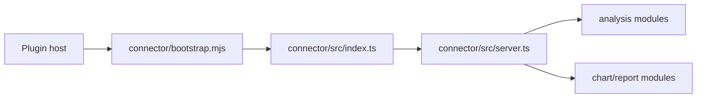

# Architecture

Analyzed source commit: `ecf88eda32182ccca352248c6dd0b20232309a31`
Generated at: `2026-07-28T04:57:25Z`
Coverage/search scope: all 38 supported source files reported by package- and file-granularity connector analysis; two unsupported files reported; no supported source deliberately skipped.

## System context

A Codex-compatible host launches the plugin's Node bootstrap, which hands control to the MCP connector over stdio. `.codex-plugin/plugin.json:15-22` `connector/src/index.ts:27-31`

## Component inventory

| Component | Responsibility | Evidence |
|---|---|---|
| Bootstrap | Detect missing or stale installation/build state and prepare the connector. | `connector/bootstrap.mjs:42-49` |
| Entry process | Resolve the target root and connect the MCP server over stdio. | `connector/src/index.ts:9-31` |
| MCP server | Register analysis, verification, chart, and report tools. | `connector/src/server.ts:70-80` |
| Report renderer | Assemble known markdown, audit data, and charts into a self-contained report. | `connector/src/report.ts:1-29` |

## Runtime/deployment view

The package exposes `dist/src/index.js` as its executable and defines build, test, and start commands. `connector/package.json:8-18`

## Module dependency view

`graph_type: module_dependency`; `resolution: syntax`. The connector analysis reported 36 resolved and 149 unresolved import relationships. This is syntax-only import/module analysis, not an actual method call graph, compiler-resolved call graph, runtime dispatch graph, or dynamic-dispatch analysis; that limitation is the server's declared contract. `connector/src/server.ts:187-210`

## External systems and data stores

The MCP SDK provides stdio transport and server primitives. `connector/src/index.ts:2-7` The default durable cache location is beneath the user's home directory unless overridden. `connector/src/server.ts:70-74`

## Major execution flows

1. Bootstrap evaluates setup state, optionally restores/builds, then imports the built entrypoint. `connector/bootstrap.mjs:74-87`
2. The entrypoint resolves the target root, validates it, creates a server, and connects stdio. `connector/src/index.ts:9-31`

## Trust boundaries

The target-root boundary is enforced by resolving one configured root before tools are registered. `connector/src/index.ts:9-27` Download approval is separate from starting a download and is represented by a one-use consent token input. `connector/src/server.ts:96-117`

## Analysis limitations

TypeScript and Python were detected, but the run used syntax parsers rather than compiler-semantic backends. The graph limitation is described above; external import relationships remained unresolved rather than being treated as internal calls. `connector/src/server.ts:187-194`
